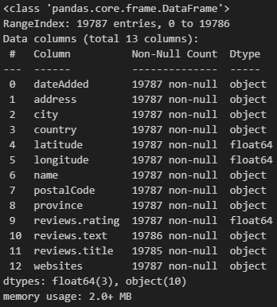

# InnSight

## Table of Contents
- [Introduction](#introduction)
- [Data](#data)
  - [Source](#source)
  - [Data Analysis](#data-analysis)
  - [Preprocessing](#preprocessing)
- [Modeling](#modeling)
  - [Approach](#approach)
- [Conclusion](#conclusion)

## Introduction
InnSight - one place to get all details about the places you are going to stay when you are travelling, on vacation or any events. This app provides detailed analysis of all the places you can stay like Hotels. Analyze reviews given by previous customers, provide you with sentimental analysis of the reviews. Help to search places with your amenities. 

## Data
### Source
We have used Dataset from Datafinity which had around 20K hotel reviews along with the ratings. Along with that we extended our search using Google Places API to get realtime reviews of desired places. We have also used date from Kaggle (airbnb).

### Data Analysis

Kept a few features from the dataset to analyze the reviews and ratings.

In the initial dataset we found that the ratings and reviews text was a good features to provide users what they need. We analyzed the reviews text to see what we can extract and score based on the sentiments. This good help users to decide if any specific place is good for them or not. 

Below are some sample charts that helps to understand sentiment analysis and frequent words used in reviews, 

  

  

### Preprocessing
There were 27 features in the dataset, but as mentioned we were more focused on actual entity details like city, state, hotel name its ratings and reviews. Other unwanted features like categories, dates and others were cleaned up along with duplicates and nulls. Even though certain fields were kept for future we didnt use it for current project. 

Using the Google API to get realtime reviews, we specified the fields that needs to be extracted from API so we are not fed with huge data. 

## Modeling
### Approach
We started by using Tdifvectorizer to understand the words in the reviews, the frequency, scoring the words which helps to get the amenities of the hotel. This can be used to help user to select the desired place. 

Then we used sentiment analysis from NLTK and TextBlob to understand the scoring of the reviews itself and provide the details to user. 

Finally we used a Langchain OpenAI and Question and Answer models to analyze the reviews. Provide analysis based on user input. 

Here is the sample output of the app, 

## Conclusion
The app is initial step towards building a larger Travel assistant and make it more interactive and effective so users can completely set their travel plan with just using their natural language. 
